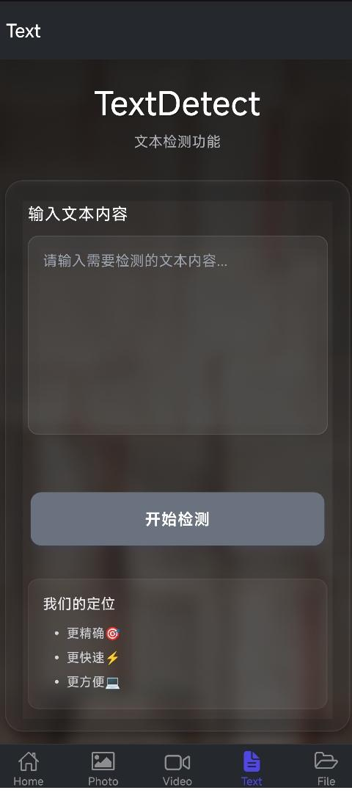
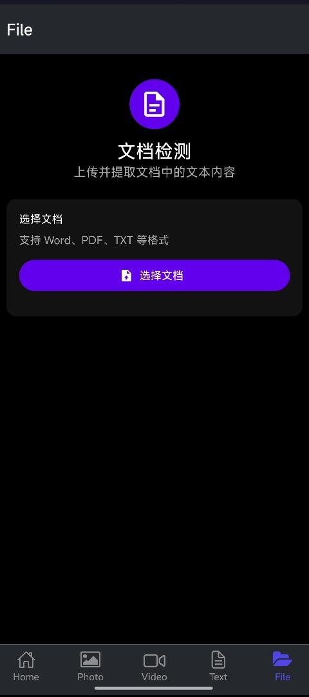
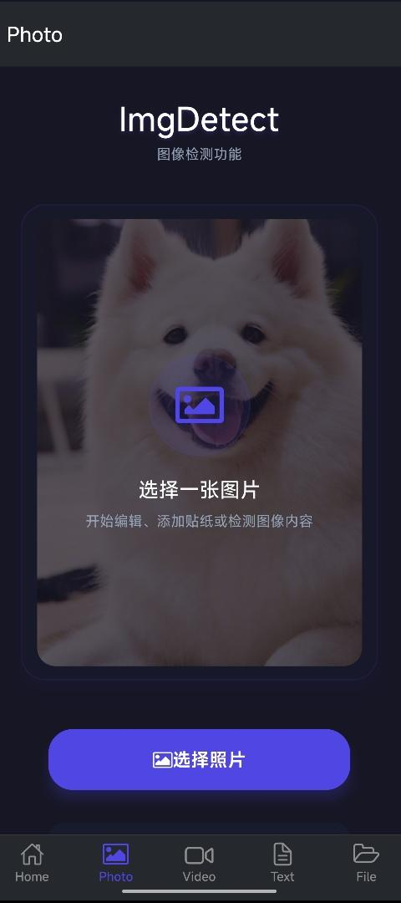
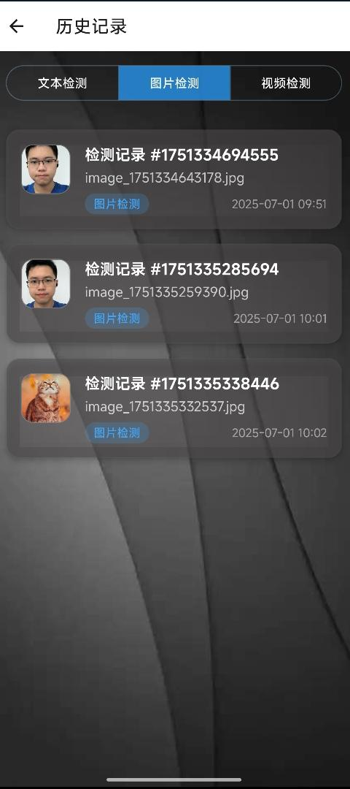

# 🌟“慧眼识真” AI-Detector：多模态 AIGC 检测工具

`AI-Detector` 是一个基于 Expo 构建的 React Native 项目，如同一位“超级侦探”🕵️‍♂️，用于对多模态内容进行鉴别，检测其是否由 AI 生成，支持对文字、图片、视频的检测功能😎。

---

## 主要功能

### 文字检测 ✍️

- **手动输入**：用户可手动输入待检测的文本内容，提交后系统将对输入的文字进行 AI 检测，以判断其是否为 AI 生成。
- **文档上传**：支持上传多种常见格式的文档，如 **WORD**、**TXT**、**MARKDOWN** 等。系统会从选定的文档中提取文本内容，并进行相应的检测。

### 图片检测 📷

用户可以上传图片，系统会对图片进行分析检测，判断图片是否由 AI 生成。

### 视频检测 📹

- **视频链接**：用户只需提供主流媒体平台的视频链接（例如**bilibili**、**youtube**等），无需本地持有视频文件，服务端会识别链接并对视频内容进行检测。
- **本地上传**：用户也可以选择本地上传视频文件，系统将对上传的视频进行检测。

### 历史记录 📜

系统会保存文字、图片和视频的检测结果，用户可以在历史记录中查看之前的检测信息，方便回顾和管理检测记录。

---

## 项目结构

```txt
Detector
├─ 📁app
│  ├─ 📁(tabs)
│  │  ├─ 📄fileDetect.jsx
│  │  ├─ 📄index.jsx
│  │  ├─ 📄photoDetect.jsx
│  │  ├─ 📄textDetect.jsx
│  │  ├─ 📄videoDetect.jsx
│  │  └─ 📄_layout.tsx
│  ├─ 📄+not-found.tsx
│  ├─ 📄history.jsx
│  ├─ 📄imgResult.jsx
│  ├─ 📄result.jsx
│  ├─ 📄videoResult.jsx
│  └─ 📄_layout.tsx
├─ 📁assets
├─ 📁utils
├─ 📁components
│  ├─ 📄CircleButton.tsx
│  ├─ 📄GuageCharter.jsx
│  ├─ 📄IconButton.tsx
│  ├─ 📄ImageViewer.tsx
│  ├─ 📄LoadingStyle.jsx
│  ├─ 📄NightingaleCharter.jsx
│  ├─ 📄PieCharter.jsx
│  ├─ 📄RadarCharter.jsx
│  ├─ 📄SplashScreen.jsx
│  └─ 📄TextShow.jsx
├─ 📄.gitignore
├─ 📄app.json
├─ 📄eslint.config.js
├─ 📄metro.config.js
├─ 📄package-lock.json
├─ 📄package.json
├─ 📄README.md
└─ 📄tsconfig.json
```

---

## 使用说明

### 安装依赖 🛠️

在项目根目录下，打开终端并执行以下命令来安装项目所需的依赖：

```bash
npm install
```

### 启动应用 🚀

安装完成后，使用以下命令启动应用：

```bash
npx expo start
```

启动后，你可以在输出信息中找到多种打开应用的选项：

- **开发构建**：参考 [开发构建介绍](https://docs.expo.dev/develop/development-builds/introduction/) 🛠️
- **安卓模拟器**：参考 [安卓模拟器使用说明](https://docs.expo.dev/workflow/android-studio-emulator/) 🤖
- **iOS 模拟器**：参考 [iOS 模拟器使用说明](https://docs.expo.dev/workflow/ios-simulator/) 🍎
- **Expo Go**：一个用于试用 Expo 应用开发的有限沙盒环境，可参考 [Expo Go](https://expo.dev/go) 🌐

---

## 页面展示（部分）

### 主页🏠


### 文字检测-用户输入🔤



### 文字检测-文档上传📂



### 图片检测📸



### 视频检测🎥


### 历史记录📑


